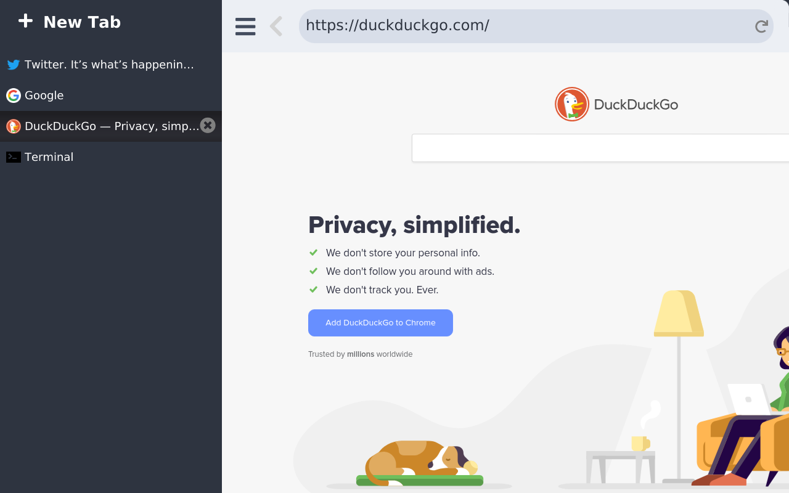
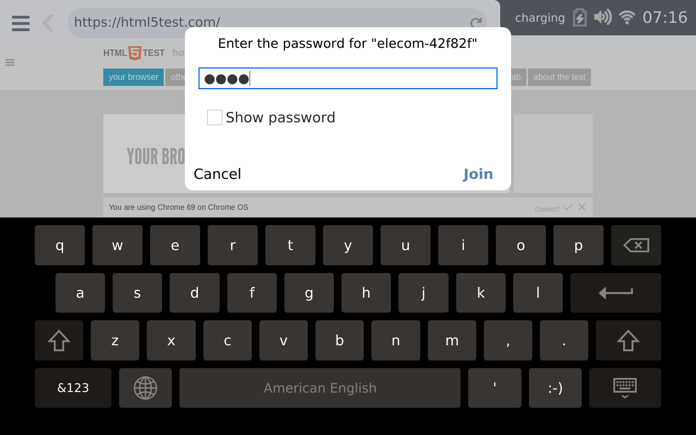
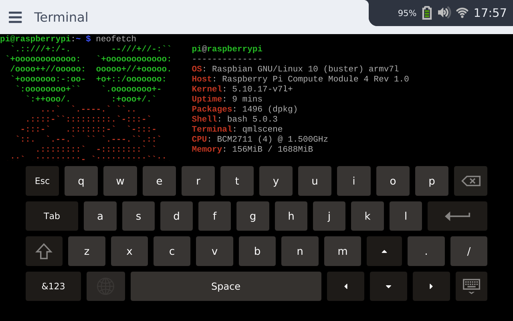
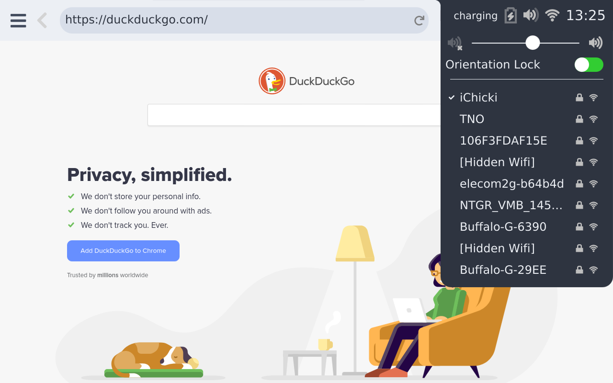

## CutiePi shell

A mobile UI for Raspberry Pi OS.

CutiePi shell is a mobile UI built for [CutiePi tablet](https://cutiepi.io) project. Check out the [demo video](https://www.youtube.com/watch?v=ivkR3tvci1Q) 

## Features

* Lockscreen with sleep/wake button events handling 
* Built-in web browser, terminal emulator, and on-screen keyboard 
* Side-tab for multitasking 
* WiFi configurator 
* Battery charging status and level reading (through UART) 
* Orientation sensor support (accelerometer and gyroscope) 

Cutiepi shell is written entirely in Qt using EGLFS QPA, and can be ported to [Wayland](https://github.com/cutiepi-io/cutiepi-shell/tree/wayland) or other platform and distributions with EGL support.

### Screenshots 

|  |  |
| ------------- | ------------- | 
|   |  |

## Dependencies 

- [Qt](http://download.qt.io/official_releases/qt/5.12/) `5.12` or later version 
- [Yat](https://github.com/jorgen/yat) for terminal emulator 
- [libconnman-qt](https://git.sailfishos.org/mer-core/libconnman-qt) and [ConnMan](https://01.org/connman) `1.37` for WiFi configuration 
- [CutiePi firmware](https://github.com/cutiepi-io/cutiepi-firmware) and [middleware plugins](https://github.com/cutiepi-io/cutiepi-middleware) for battery and sleep/wake button related functions 
- [QtMpu6050](https://github.com/cutiepi-io/QtMpu6050) for QtSensors plugin support (optional) 

## License 

* CutiePi shell sources are licensed under the terms of the GNU General Public License version 3 or, at your option, any later version. 
* And all documentations are licensed under a Creative Commons BY-SA 4.0 international license. 
* This project uses [Font Awesome](https://fontawesome.com/license/free) fonts, which is licensed under `SIL OFL 1.1 License`. 

* Icons are from the `gnome-user-docs` package with following copyright information `Copyright: Copyright (C) 2010 - 2014 Shaun McCance`, and licensed under `CC-BY-3.0`. 

