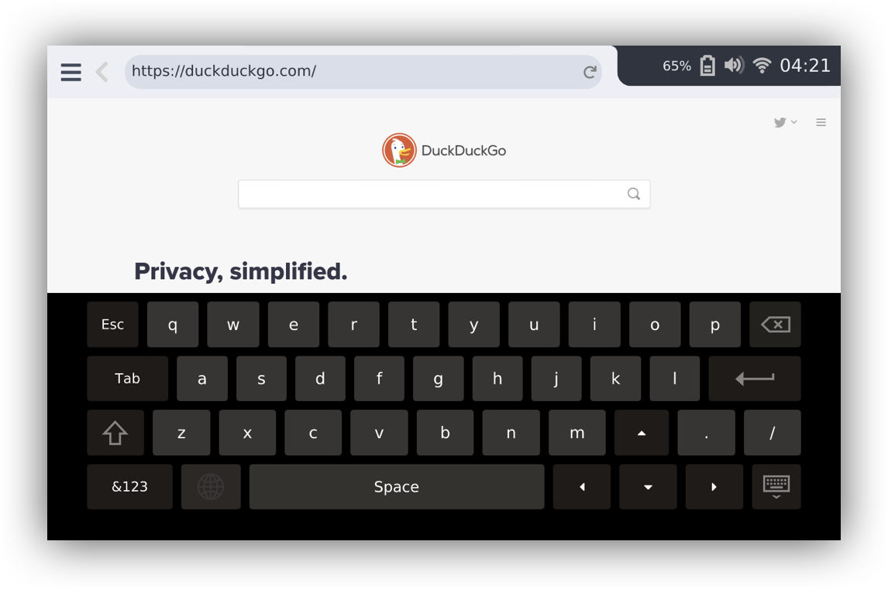

## CutiePi shell

A mobile UI for Raspberry Pi and Raspbian OS.

CutiePi shell is built for the open source [CutiePi tablet](https://cutiepi.io) project.

## Features

* Lockscreen with sleep/wake button
* Built-in web browser, terminal emulator, and on-screen keyboard 
* Side-tab layout for multitasking 
* WiFi configuraton 
* Battery charging status and level reading (through STM32 MCU)
* Orientation sensor support 

Cutiepi shell is written entirely in Qt, and can be ported to Wayland or any platform with EGL support.

## Dependencies 

- [Qt](http://download.qt.io/official_releases/qt/5.12/) `5.12.5`
- [Yat](https://github.com/jorgen/yat) for terminal emulator
- [libconnman-qt](https://git.sailfishos.org/mer-core/libconnman-qt) and [ConnMan](https://01.org/connman) `1.37` for WiFi configurator
- [CutiePi firmware](https://github.com/cutiepi-io/cutiepi-firmware) and [middleware plugins](https://github.com/cutiepi-io/cutiepi-middleware) for battery and sleep/wake button related functions 
- [QtMpu6050](https://github.com/cutiepi-io/QtMpu6050) QtSensors plugin

## Licensing 

Icon assets are from `gnome-user-docs` package with following license and copyright information: 

    Copyright: Copyright (C) 2010 - 2014 Shaun McCance
    License: CC-BY-3.0

* This project also used [Font Awesome](https://fontawesome.com/license/free) fonts, which is licensed under `SIL OFL 1.1 License`. 
* CutiePi shell source code are licensed under the terms of the GNU General Public License version 3 or, at your option, any later version. 
* And all documentation is licensed under a Creative Commons BY-SA 4.0 international license. 
